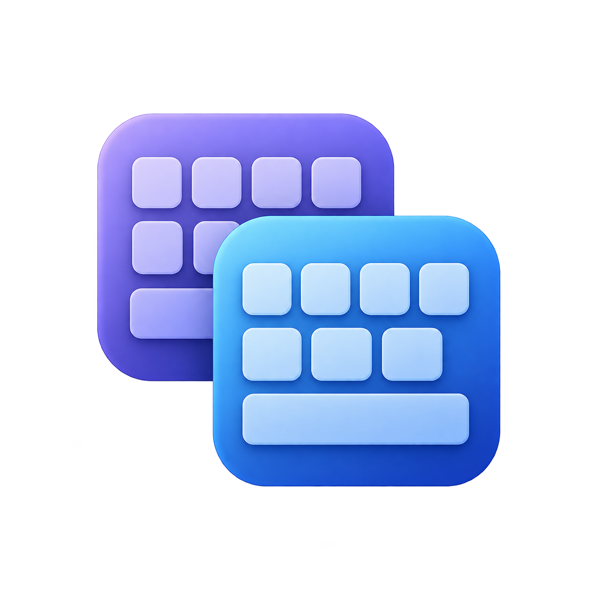

# Key Layout Manager

<p align="center">
  
</p>

Small native macOS utility for managing Adobe Premiere keyboard layouts,
source assignment presets, panel layouts, and full-profile backups. SwiftUI,
non-sandboxed, Developer ID signed for distribution.

Premiere stores per-user data at:

```
~/Documents/Adobe/Premiere Pro/<version>/Profile-<username>/
    Mac/<name>.kys                                 # keyboard shortcut layouts
    Settings/Source Patcher Presets/<name>.sppreset  # source assignment presets
    Layouts/UserWorkspace*.xml                     # saved panel layouts
    …everything else (prefs, …)
```

Moving any of that between Macs in Finder means hunting through nested
Adobe folders. This app collapses it to one window:

- **Export** — browse every `.kys`, `.sppreset`, and panel layout `.xml` Premiere has on the
  local machine, multi-select, drag straight into Slack / Mail / Finder
  or export to a folder, iCloud Drive, or Dropbox. Right-click a profile
  to back up the *entire* `Profile-<user>` folder as a standalone `.zip`.
- **Restore** — drop loose `.kys` / `.sppreset` / panel layout `.xml` files (or a backup
  `.zip`) onto the window, or pick via the file panel. Backup zips
  expand into a grouped, per-entry checklist so a "restore only the
  keyboard layout" workflow stays one click away. Pick a destination
  profile (can differ from the source's Premiere version) and restore.
  Standard collision prompt (Overwrite / Keep both / Skip, plus "Apply
  to all remaining") covers any conflicts. Hover any incoming row to
  see a tooltip describing what that file does.

Panel layouts appear in their own **Panel Layouts** subsection. XML imports
are checked for Premiere's workspace marker; unrelated XML and
`WorkspaceConfig.xml` are excluded from individual layout transfers. Save the
arrangement in Premiere with **Window > Workspaces > Save as New Workspace**
before exporting. Quit Premiere before restoring, then relaunch it and select
the workspace from **Window > Workspaces**. Layouts can depend on the Premiere
version and monitor arrangement; those should be checked on the receiving Mac.
Full-profile backups still include workspace configuration as well.

The version label adapts: Premiere 26 and later show as "Premiere
\<version\>", earlier versions as "Premiere Pro \<version\>" — Adobe
dropped "Pro" from the product name in v26.

`.DS_Store`, AppleDouble metadata, and Premiere's regenerable
`metadatacache.prmdc2*` files are filtered out of every backup, both
when writing and when listing existing zips.

## Requirements

- macOS 14 or later on an Apple silicon Mac
- Xcode 15+ for development
- An Apple Developer ID for signed, notarized distribution

## Setup

```bash
./setup.sh
```

Installs [XcodeGen](https://github.com/yonaskolb/XcodeGen) via Homebrew
if needed, then generates `KeyLayoutManager.xcodeproj` from
`project.yml`. The `.xcodeproj` is gitignored — never hand-edit it;
change `project.yml` and re-run `xcodegen`.

If `xcode-select -p` points at Command Line Tools, switch it:

```bash
sudo xcode-select --switch /Applications/Xcode.app/Contents/Developer
```

Then:

```bash
open KeyLayoutManager.xcodeproj
```

Set your Team in **Signing & Capabilities** (or add
`DEVELOPMENT_TEAM` to `project.yml`) and hit Run. Without a team, Debug
builds are ad-hoc-signed and macOS will re-prompt for Documents-folder
access on every launch — a stable signature is what makes the TCC
grant stick.

## Project layout

```
KeyLayoutManager/
  App/        # @main + RootView (Export / Restore tabs) + Sparkle
  Models/     # PremiereItemKind, PremiereInstall, ProfileLocation,
              # KeyboardLayout, IncomingItem, BackupManifest,
              # PremiereProduct (version → name), PremiereFileInfo (tooltips)
  Services/   # PremiereScanner, CopyService, CloudTargets, TempStage,
              # ZipService (wraps /usr/bin/zip and /usr/bin/unzip)
  Features/
    Export/   # source list, drag source, four export targets,
              # "Back Up Profile…" + "Delete Profile…" context menu
    Restore/  # drop zone, destination picker, grouped checklist,
              # manifest banner, collision alert
  Resources/  # Info.plist, entitlements
  Assets.xcassets/
KeyLayoutManagerTests/
  PremiereScannerTests, CopyServiceTests,
  ZipServiceTests, BackupManifestTests,
  PremiereProductTests, PremiereFileInfoTests
project.yml   # XcodeGen config
setup.sh      # bootstrap
release-build.sh  # archive → notarize → staple → sign → upload → appcast
appcast.xml   # Sparkle feed
```

## Run the unit tests

```bash
xcodebuild test -scheme KeyLayoutManager -destination 'platform=macOS'
```

The test suites cover scanner edges (empty `Mac/`,
missing `Mac/`, multi-digit version sort, non-version sibling dirs),
`CopyService` policies (overwrite, keepBoth name-bumping, skip, prompt
routing), zip round-trip (create → list → extract a subset), backup
manifest encode/decode, product-name version threshold, and
file-description coverage.

## Manual test plan

1. **First launch.** "Documents folder" TCC prompt appears once. Click
   Allow. Subsequent launches stay silent (assuming a stable signing
   identity).
2. **Export tab.** Newest Premiere version → profile → `Keyboard Layouts`
   and `Source Assignment Presets` subsections render under the profile.
   Sidebar header reads "Premiere 26.0" for v26+ and "Premiere Pro 25.x"
   for older.
3. **Drag.** Drag a row out into Finder, Slack, or Mail.
4. **Export to…** Pick a folder via Save panel.
5. **iCloud / Dropbox backup.** Buttons appear when the corresponding
   cloud root exists; files land under `KeyLayoutManager/<version>/`.
6. **Per-item restore.** Drop a loose `.kys` or `.sppreset` on the
   Restore tab. Destination dropdown defaults to newest profile. Click
   Restore.
7. **Collision prompt.** Restore the same file again. Overwrite / Keep
   both / Skip alert with "Apply to all remaining" toggle. `Keep both`
   produces `Name (2).kys`.
8. **Full profile backup.** Right-click a profile in the Export tab →
   "Back Up Profile…" → choose a save location. The resulting `.zip`
   contains the entire `Profile-<user>` tree plus a
   `KeyLayoutManager-manifest.json` at the root. `.DS_Store`,
   AppleDouble (`._*`), and `metadatacache.prmdc2*` files are absent.
9. **Full restore.** Drop the new `.zip` on the Restore tab. The banner
   shows "Backup of Premiere \<version\> — \<profile\>, \<date\>".
   Entries appear grouped by top-level folder with checkboxes; pick a
   destination profile, click "Restore N items".
10. **Partial restore.** Load the same `.zip`, untick everything except
    `Mac/<your>.kys`, click Restore. Verify only that one file is
    copied.
11. **Cross-version restore.** Pick a destination profile whose
    Premiere version differs from the backup's. Restore still proceeds
    (you accept any version mismatch consequences).
12. **Right-click delete.** Right-click a profile → "Delete Profile…" →
    confirm. Profile folder moves to Trash; sidebar refreshes.
13. **Tooltips.** Hover an incoming row on the Restore tab — known
    file types (kys, sppreset, `Adobe Premiere Pro Prefs`, `.guides`,
    workspaces, …) show a one-sentence description.

## Distribution

Non-sandboxed, hardened runtime, empty entitlements file. Sparkle 2 is
wired up — `appcast.xml` lives at the repo root, signed `.zip` releases
are hosted on
[GitHub Releases](https://github.com/aagedal/KeyLayoutManager/releases),
and existing installs see "Check for Updates…" under the app menu. Codeberg
keeps a synchronized legacy appcast for builds released before the feed moved.

### Releasing

One-time setup:

```bash
# notarytool credentials (re-uses the "Notary" profile referenced below)
xcrun notarytool store-credentials Notary \
  --apple-id <appleid> --team-id <teamid> --password <app-specific-pw>

# Authenticate the GitHub CLI for release uploads
gh auth login
```

Then for each release, bump `MARKETING_VERSION` / `CURRENT_PROJECT_VERSION`
in `project.yml`, regenerate the project, and run:

```bash
./release-build.sh                 # version read from project.yml
./release-build.sh 1.1.0 2         # or override version + build
```

The script archives, exports, notarizes, staples, zips (with AppleDouble
metadata stripped so Gatekeeper doesn't reject the bundle), signs the
zip with Sparkle's EdDSA key, creates a GitHub release, uploads the
zip, and appends a new `<item>` to `appcast.xml`. Commit and push
`appcast.xml` to GitHub, then synchronize the legacy Codeberg copy for
older installed builds.

The Sparkle EdDSA private key is shared with Aagedal Media Converter
(single keychain entry); `bin/sign_update` is Sparkle's signing helper.

If you need to notarize a one-off build by hand instead:

```bash
xcrun notarytool submit KeyLayoutManager.zip \
  --keychain-profile "Notary" --wait
xcrun stapler staple KeyLayoutManager.app
```
